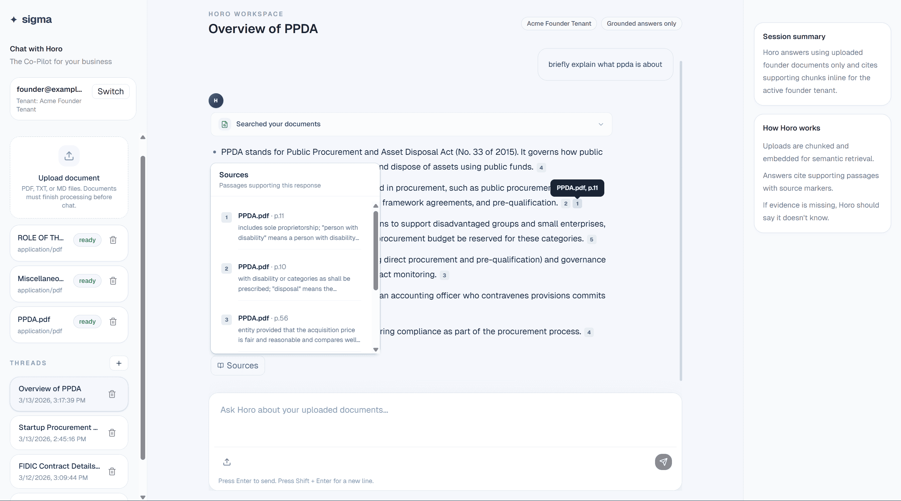

# SIGMA

SIGMA is a founder-facing knowledge assistant with a simple multi-tenant RAG workflow. Each founder gets a private knowledge base, uploads internal files, and chats with Horo to get short answers grounded in their own documents.

## What this prototype demonstrates

- **Private founder knowledge bases**
  - Documents, chat threads, and retrieval are scoped to the authenticated founder.
  - Other tenants' files are never searched.

- **Source-backed answers**
  - Horo answers from uploaded files and shows quick citations such as `Loan Policy, p. 3`.
  - Citations are rendered inline and can be inspected in the response UI.

- **Helpful failure mode**
  - If the answer is not supported by the founder's files, Horo should say it does not know and guide the founder to upload the right file.

- **Simple file upload flow**
  - Uploaded files are parsed, chunked, embedded, and stored for retrieval.
  - Chat answers are generated from the most relevant chunks for the active founder.

## Product brief

Founders keep important information in files such as pitch decks, policies, handbooks, and finance sheets. On SIGMA, each founder has a private knowledge base. Horo answers questions from the founder's own files, cites supporting pages, and avoids fabricating unsupported answers.

Example behaviors:

- **Loan policy question**
  - “What’s the maximum loan size for first-time borrowers?”
  - Horo answers and cites `Loan Policy (p. X)`.

- **Operational handbook question**
  - “List the onboarding steps for our program.”
  - Horo answers with multiple references to `Program Handbook` pages.

- **Missing information question**
  - “What’s our CAC?”
  - If the file is missing, Horo responds with an `I don’t know` style answer and suggests uploading the relevant finance or growth document.

## RAG approach

This prototype keeps retrieval simple, explainable, and tenant-scoped.

### End-to-end flow

1. **Founder uploads a file**
   - A document is attached to the authenticated founder and never shared across tenants.

2. **The backend prepares it for retrieval**
   - The file is parsed into page-aware chunks, embedded, and stored with founder ownership metadata.

3. **The founder asks Horo a question**
   - The query is embedded and matched only against that founder's chunks.

4. **Horo answers from retrieved evidence**
   - The model receives the top matching chunks and is instructed to stay grounded in those results.

5. **The UI shows citations**
   - Answers include inline citations that map back to the source document and page so the founder can verify the response quickly.

6. **If evidence is missing, Horo says so**
   - Instead of guessing, the assistant gives an `I don't know` style response and suggests uploading the missing document.

### Retrieval pipeline

1. **Upload → parse → chunk**
   - Documents are parsed, split with overlap, and tagged with document title + page.

2. **Embed + store**
   - Chunks are embedded and stored in Postgres with `pgvector`, keyed by `user_id`.

3. **Query-time retrieve**
   - Semantic search runs only over chunks belonging to the authenticated founder.
   - Top-k results (configurable) are returned with their metadata.

4. **Grounded generation**
   - Retrieved chunks are provided to the model; the assistant is expected to answer concisely and stay within evidence.

### Citations and provenance

- Inline markers like `[1]` map to document title, excerpt, and optional page.
- The UI renders inline markers plus a sources popover so founders can inspect evidence quickly.
- Citations are part of the answer flow, not an afterthought: retrieved chunk metadata is preserved through generation so the UI can show where each answer came from.
- If evidence is weak or missing, the assistant should say it doesn’t know and prompt for the right file.

### Isolation and safety

- Retrieval, documents, and chat threads are filtered by `user_id`.
- Cross-tenant retrieval is disallowed by design; other tenants’ files are never searched.
- Sensitive IDs are masked during ingestion (emails and Luhn-valid card numbers are replaced with `[REDACTED]`) before embedding and retrieval.

## Demo authentication

The prototype includes simple JWT-based demo authentication to show tenant isolation with two founders:

- **Acme**
  - `founder@acme.io` / `acme-demo`

- **Nova**
  - `founder@nova.io` / `nova-demo`

Switching users shows that uploaded files, retrieval, and chat history remain private to each founder.

## Live demo

You can review the deployed prototype here:

- **App URL**
  - `https://sigma-eta-one.vercel.app/`

### Example UI



### Suggested review flow

1. **Log in with a demo founder**
   - Start with `founder@acme.io` / `acme-demo`.

2. **Upload a document**
   - Upload a policy, handbook, or finance-related file.
   - Wait for the upload to finish so the file can be chunked and indexed.

3. **Ask a grounded question**
   - Try a question that should be answerable from the uploaded file.
   - Confirm that Horo responds briefly and includes citations tied to the uploaded source.

4. **Inspect the citations**
   - Open the inline citation or source UI and verify that the answer points to the expected document and page.

5. **Ask a question the file does not support**
   - For example, ask for a metric or policy detail that is not present.
   - Confirm that Horo avoids guessing, says it does not know, and suggests uploading the right supporting file.

6. **Switch to the second founder**
   - Log in as `founder@nova.io` / `nova-demo`.
   - Verify that the other founder cannot see Acme's uploads, retrieval results, or chat history.

### What to look for

- **Grounded answers**
  - Responses should stay short and based on uploaded context.

- **Useful citations**
  - Each answer should point back to a document title and page when available.

- **Good failure behavior**
  - Missing evidence should produce an `I don't know` style response rather than a fabricated answer.

- **Tenant isolation**
  - Uploaded content and retrieval should remain scoped to the active founder.

## Stack

- **Frontend**
  - Next.js
  - React
  - TanStack Query

- **Backend**
  - FastAPI
  - SQLAlchemy
  - Postgres
  - pgvector
  - LangChain
  - OpenAI models for chat and embeddings

## Local development

### Backend

From `backend/`:

```bash
uv sync
uv run uvicorn app.main:app --host 0.0.0.0 --port 8000
```

Backend environment variables typically include:

- `DATABASE_URL`
- `OPENAI_API_KEY`
- `JWT_SECRET_KEY`
- `CORS_ORIGINS`

### Frontend

From `frontend/`:

```bash
pnpm install
pnpm dev
```

Set `NEXT_PUBLIC_API_BASE_URL` if the backend is not running at `http://localhost:8000/api`.

## Deliverable summary

This repo delivers:

- **A concise RAG prototype**
  - Founder-scoped retrieval over uploaded files

- **A functional chat and upload workflow**
  - Upload, retrieve, answer, and cite

- **A clear tenant isolation demo**
  - JWT auth with separate demo founders and isolated data
